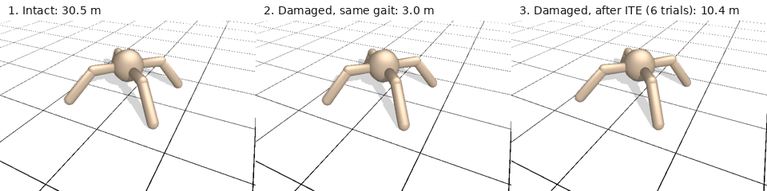

# Few-trial damage recovery with Quality-Diversity repertoires

A simulated four-legged robot loses the use of a leg. How many trials does it need to walk again, and does it
matter whether its repertoire of gaits was built with or without reinforcement learning?



*Brax Ant, DCRL-ME repertoire, front-right leg paralysed. Mean distance in 12.5 s: 30.6 m intact, 2.8 m damaged
with the same gait, 9.4 m with the gait found by ITE in 6 trials.*

## What I did

- Built gait repertoires at equal budget with **MAP-Elites**, **PGA-ME** and **DCRL-ME** (3 seeds each,
  512,256 episodes per run) using JAX, QDax and Brax on Kaggle GPUs.
- Damaged the robot in 12 ways (paralysed or weakened legs, ankles, two legs).
- Adapted with **Intelligent Trial & Error** (Cully et al., *Nature* 2015), compared with simple baselines and with
  **TD3 re-training**, counting every episode played on the damaged robot.

## Results

| | MAP-Elites | PGA-ME | DCRL-ME |
|---|---|---|---|
| Coverage | 72 % | 77 % | **84 %** |
| Best gait left after damage (p, 1 ≈ 15 m) | 0.23 | **1.84** | 1.14 |
| Gait found by ITE (p) | 0.11 | **1.47** | 0.59 |

- Repertoires built with RL are as resilient as MAP-Elites in relative terms (no significant difference) and much
  better in absolute terms.
- ITE stops after a median of **5 trials** and recovers 33 % of the intact progress (18 % without adaptation).
  Simply trying gaits by decreasing intact performance does almost as well: ITE's small edge after 3 trials is
  gone after 5. The quality of the repertoire matters more than the adaptation algorithm.
- TD3 matches ITE in only 6 of 16 runs, after more than 1,000 episodes (except one run where the intact policy
  was already good enough).
- Letting ITE search the gaits of DCRL-ME's descriptor-conditioned actor instead of the repertoire is clearly worse.

Full report: [`report/report.pdf`](report/report.pdf). Every number in it is generated from `results/`.

## Run it

```bash
python3.12 -m venv .venv && source .venv/bin/activate
pip install -e ".[dev,viz]"          # CPU; on a GPU: pip install -e ".[cuda12]"
pytest -m "not slow"

python -m qd_damage.repertoires --algo dcrlme --seed 0    # add --profile smoke for a quick CPU run
python -m qd_damage.oracle      --runs results/repertoires/dcrlme_seed0
python -m qd_damage.adaptation  --runs results/repertoires/dcrlme_seed0
python -m qd_damage.rl_retrain  --scenario leg4_paralysed --variant scratch --seed 0
python -m qd_damage.analysis.report
```

## Layout

```
src/qd_damage/   environment and damages, repertoires, oracle, ITE and baselines, TD3, analysis, visuals
configs/         shared settings, per-algorithm hyper-parameters, damages, ITE, RL
kaggle/          GPU scripts used for the campaign
results/         metrics and summaries of every run (repertoires themselves are not versioned)
media/           videos, interactive 3D pages, figures
report/          report and its generated tables
docs/            protocol, development notes, compute budget
contrib/qdax/    standalone ITE example notebook for QDax
```
